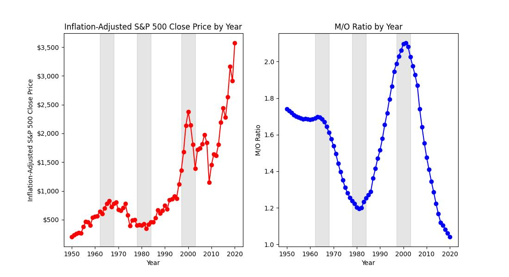

# Stock Price And Population Age
An analysis of the relationship between U.S. stock prices and U.S. age demographics.

## Table of Contents
* [General Information](#general-information)
* [Technologies Used](#technologies-used)
* [Setup](#setup)
* [Data Ingestion](#data-ingestion)
* [Data Transformation](#data-transformation)
* [Data Analysis](#data-analysis)

## General Information
According to [Investopedia](https://www.investopedia.com/articles/basics/04/100804.asp#:~:text=traders%20and%20investors.-,Fundamental%20Factors,as%20a%20P%2FE%20ratio), there are three categories of forces that affect stock prices - fundamental factors, technical factors, and market sentiment. Of these three forces, I find technical factors to be the most interesting, specifically age demographics. With [reports](https://www.bbc.com/news/world-us-canada-57003722) of the U.S. birth rate declining (along with many other countries), I was curious what impact, if any, it might have on the stock market. To explore the potential relationship between stock prices and age demographics, I compared historical inflation-adjusted close prices of the S&P 500 with U.S. population age data for the years 1950-2020.

The S&P 500 index is widely seen as representative of the health of the U.S. economy, and since I'm interested in analyzing stock prices at a macro-level, it seemed like a great choice. I used inflation-adjusted close prices to eliminate inflation as a factor for the change in close prices so that I could have an "apples-to-apples" comparison over time. [multpl](https://www.multpl.com/inflation-adjusted-s-p-500/table/by-year) has a nice table of historical inflation-adjusted S&P 500 close prices, and this is the source of the stock price data that I used.

The [U.S. Census Bureau](https://www.census.gov/data.html) has a treasure trove of publicly available demographic data, including the estimated population of the U.S. over time, broken down by single year of age. This is the source of the age data that I used.

## Technologies Used
- Python 3.10.2

## Setup
Project dependencies are listed in the **/requirements.txt** file.

To run this project:
1. Clone this repository.
2. Ingest the data:
   - Obtain an API key from the U.S. Census Bureau by requesting one [here](https://api.census.gov/data/key_signup.html).
   - Open the **ingest_pop_age_1990_to_1999.py** script, enter your API key in the "parameters" variable, and save the file.
   - Open the **ingest_pop_age.py** script, set the value of the "pathToNormalizedDataDirectory" variable to the fully-qualified path of your "normalized_data_files" directory from the repository you just cloned, and save the file.
   - Run the **ingest_pop_age.py** script.
   - Run the **ingest_stock_prices.py** script.
3. Transform the data:
   - Run the **compute_median_age_by_year.py** script.
   - Run the **compute_middle_to_old_ratio.py** script.
   - Run the **compute_middle_age_pop_by_year.py** script.
4. Analyze the data:
   - Run the **stock_price_median_age_line_chart.py** script.
   - Run the **stock_price_mo_ratio_line_chart.py** script.
   - Run the **stock_price_middle_age_pop_line_chart.py** script.

## Data Ingestion
### Population Age Data
#### Disclaimer

This product uses the Census Bureau Data API but is not endorsed or certified by the Census Bureau.

#### Data Source

All population age data is sourced from the [United States Census Bureau website](https://www.census.gov/data.html). To get the entire population of the United States, I used the Estimated Resident Population plus Armed Forces Overseas. To be able to calculate some statistics, I used the population estimates that are broken down by Single Year of Age. Data for different years is structured differently, and so I wrote custom Python scripts to ingest each unique data source.

- **1950 - 1979:** [Excel files](https://www.census.gov/data/tables/time-series/demo/popest/pre-1980-national.html). Annual estimate calculated in July.
- **1980 - 1989:** [Fixed-width text files](https://www.census.gov/data/datasets/time-series/demo/popest/1980s-national.html) decoded with file layout specification (modified for 2-digit year for pre-1990 estimates that use this file structure). I used the July estimate for each year.
- **1990 - 1999:** [Population Estimates API](https://www.census.gov/data/developers/data-sets/popest-popproj/popest.1990-2000_Intercensals.html). Annual estimate calculated in April.
- **2000 - 2010:** [CSV file](https://www.census.gov/data/datasets/time-series/demo/popest/intercensal-2000-2010-national.html). I used the July estimate for each year.
- **2011 - 2020:** [CSV files](https://www.census.gov/data/tables/time-series/demo/popest/2010s-national-detail.html). I used the July estimate for each year.

To verify that I pulled the data correctly, I used the [Federal Reserve Bank of St. Louis's population data](https://fred.stlouisfed.org/graph/?id=POP,) as a cross-check. There are some small differences due to the St. Louis Fed's rounding, and potentially pulling data from a United States Census Bureau source that was calculated in a slightly different way (you can get population estimates for the same date range in multiple places on the Census Bureau's website).

#### Data Normalization

Since each unique data source is structured differently, I normalized the population data to conform to this schema:

| Year (int) | Age (int) | Population (int) |
| ---------- | --------- | ---------------- |
| 1950       | 0         | 3,162,567        |
| 1950       | 1         | 3,299,863        |
| ...        | ...       | ...              |
| 1950       | 85        | 589,612          |
| 1951       | 0         | 3,315,027        |
| ...        | ...       | ...              |
| 2020       | 85        |  6,739,054       |

Due to some data sources lumping all ages greater than 84 into one bucket of 85+, the age 85 in my schema represents 85+. The normalized data from each source was written to a separate CSV file, then all of the CSV files were combined into one CSV file.

### Stock Price Data
The historical inflation-adjusted S&P 500 close prices were scraped from the table on [multpl](https://www.multpl.com/inflation-adjusted-s-p-500/table/by-year). The data was filtered to the years 1950-2020, the year portion of the date was extracted, and the resulting data was written to a CSV file.

## Data Transformation
To prepare the population age data for analysis, three different transformations were applied to calculate three different statistics:
* Median age by year
* Middle-to-old ratio by year
* Middle age population by year

Middle age is defined as ages 40-49, and old age is defined as ages 60-69. The thought behind this categorization is that people's investment behavior changes as they near retirement age. People in their 40's tend to have more aggressive portfolios with a higher proportion of stocks, and they have more disposable income compared to people in their 20's and 30's who are often saving money for a down payment for a home. As people enter their 60's, their portfolio shifts away from stocks to lower-risk bonds. The "Glidepath and asset allocation" section of [Vanguard's Target Retirement 2060 Fund (VTTSX) product page](https://institutional.vanguard.com/investments/product-details/fund/1691) provides a great visual depiction of this shift:

The higher the population of middle-aged people, the higher the demand for stocks, which puts upward pressure on stock prices. The higher the population of old-aged people, the lower the demand for stocks, which puts downward pressure on stock prices. The ratio of middle-to-old would then be a sort of "multiplier" for stock prices.

The results of each of the three transformation were written to separate CSV files.

## Data Analysis
Using matplotlib, each of the three statistics were plotted alongside the historical inflation-adjusted S&P 500 close prices. Some interesting observations can be made by comparing the charts.

Around the 1970s, both stock prices and median age start an upward trend that ultimately never stops. Much of this is due to the shift of the U.S. economy away from World War II to domestic growth, as well as the end of the Baby Boom in 1964. An increasing median age seems to correlate with increasing stock prices.

Drilling down a little deeper, we compare the ratio of middle aged (40-49) population to old aged (60-69) population. Both series have a local maximum in the mid 1960's, local minimum in the early 1980's, and local maximum around the turn of the century. Before the 1960's and after the turn of the century, the series go off in opposite directions, most dramatically after 2010. This opposite behavior is puzzling. Perhaps some of the many other stock price factors are at play here.

To try to understand the opposite behavior before the 1960's and after the year 2000, let's remove the old-aged population from the picture and look solely at the middle-aged population. The local maxima and local minimum from the previous chart comparison are still present in this one, but the opposite behavior is now mostly gone. After 2010, the middle-aged population does decrease, but not as dramatically as the M/O ratio did. There seems to be a better correlation between stock price and middle aged population. Perhaps the upward pressure of the middle-aged population is a stronger factor for stock prices than the downward pressure of the old-aged population.

Now that we've identified that the middle-aged population seems to correlate with stock prices, let's measure the linear relationship between these variables using Pearson's population correlation coefficient (since we have the entire population of each variable, we do not need a hypothesis test). We'll start by plotting the data on a scatter plot.

Then, we'll compute Pearson's population correlation coefficient using SciPy's **stats** module.

`Pearson's population correlation coefficient: 0.83`

A population correlation coefficient of **0.83** tells us that there is, in fact, a fairly strong positive linear relationship between the middle-aged population and stock prices. When the middle-aged population increases, stock prices tend to also increase.
